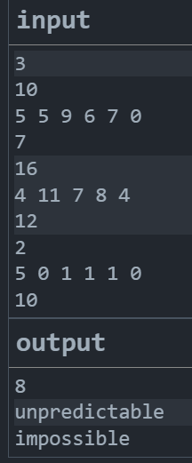
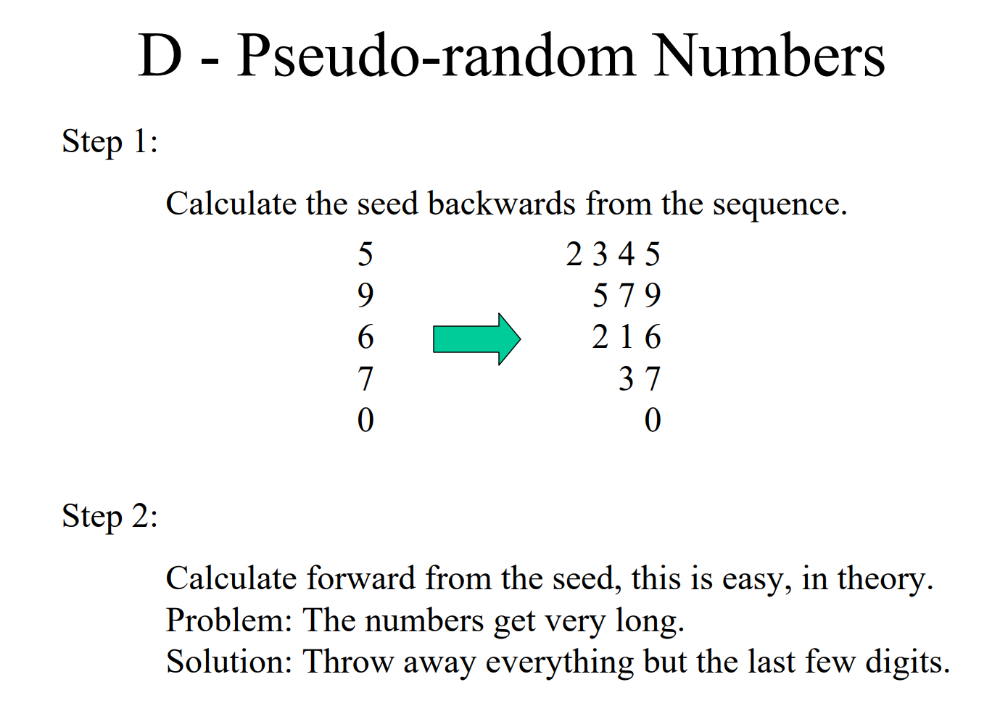
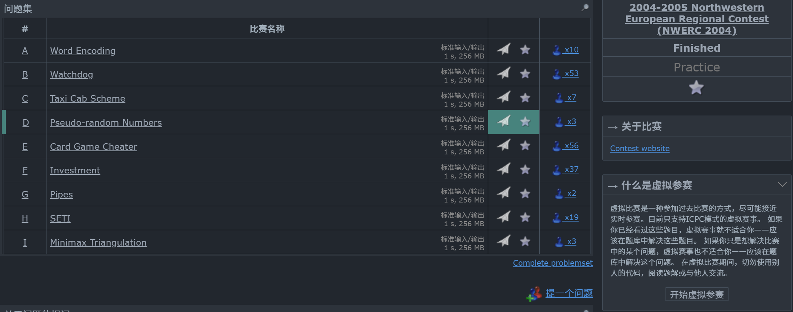

# [2004-2005 Northwestern European Regional Contest (NWERC 2004)](https://codeforces.com/gym/106175)
20年前的一场比赛，我还没出生哈哈

[题面陈述（英文）](https://codeforces.com/gym/106175/attachments/download/34154/NWERC04-problems.pdf)
[官方题解](https://codeforces.com/gym/106175/attachments/download/34155/nwerc2004solutions.pdf)


vp时间2026/3/15 13：00-18：00，写于2026/3/26

os：时隔半个月，终于有时间来研究一下之前vp卡住的题目，一天到晚忙死了也不知道在忙些什么，
感觉每天都在退步，看什么都一脸懵逼，可能是少年痴呆了吧┗|｀O′|┛

下面是卡住的题目：vp的时候先MLE，快结束的时候又TLE了，感觉是因为我每次都在模拟整个过程，导致空间和时间复杂度过高了。
老天聪明的人那么多，多我一个不多，少一个不少，肯定有更优雅的解法的！所以我想在这里记录一下我的思路和方法论，看看能不能找到更优雅的解法。

[D. Pseudo-random Numbers](https://codeforces.com/gym/106175/problem/D)
---
>获得高质量的随机性对许多应用都非常重要，尤其是在密码学中。放射性衰变有时被用作 "真正随机性 "的来源，但这种获得随机数的过程相当缓慢。此外，在许多应用中，在两个不同的地方产生相同的 "随机 "序列也很重要。因此，人们通常使用伪随机序列来代替。伪随机序列实际上不是随机序列，但很难与真正的随机序列区分开来。伪随机序列还应该是难以预测的，也就是说，给定序列的前几个元素，就很难确定序列中后面的某个未知数。
>
>密码机械协会 (ACM) 设计了一种生成伪随机数序列的算法，但他们不知道这种算法到底有多好。因此，他们希望你能对其进行测试。
>
>生成整数序列的算法如下，其中每个整数都在 0 和 $$B - 1$$ 之间（包括 0 和 $$B - 1$$ ）：
>
>1.  从基数为 $$B$$ 的任意数字（种子）开始。这个数字可以包含数百个基数 $$B$$ 的数字。
>2.  最后一位数字（最小有效数字）将作为序列的下一个元素输出。
>3.  从左到右写下所有相邻数字之和，创建一个新数字。例如，在 $$B = 10$$ 中，数字 845 将产生数字 129（因为 $$8 + 4 = 12$$ 和 $$4 + 5 = 9$$ ）。
>4.  根据需要多次重复步骤 2 和 3，直到数字只有一个基数 $$B$$ 。每次都会得到一个介于 0 和 $$B - 1$$ 之间的伪随机数字。
>
>如果我们有 $$B = 10$$ ，种子数是 845，那么接下来的数字将是 129、311（ $$1 + 2 = 3$$ 、 $$2 + 9 = 11$$ ）、42（ $$3 + 1 = 4$$ 、 $$1 + 1 = 2$$ ）和 6（ $$4 + 2 = 6$$ ）。由于 6 是基 10 的个位数，因此算法终止。生成的伪随机数为 5、9、1、2 和 6。
>
>您将对生成器进行如下测试。您将得到生成器输出的第一个 $$L$$ 元素和一个整数 $$T \gt L$$ 。您需要判断前 $$T$$ 个元素是否完全由前 $$L$$ 个元素决定。为了检验测试程序的稳健性，ACM 添加了一些不可能序列，即任何初始种子都无法生成的序列。

**Input**
>On the first line of the input is a single positive integer $N$, telling the number of test cases to follow. The first line of each test case consists of one integer $B$ ($2 \le B \le 1\,000$), the base. The second line consists of an integer $L$ ($1 \le L \le 100$), followed by the $L$ first elements of some sequence (the elements are written in base 10 and are between 0 and $B - 1$ inclusive). The third line consists of an integer $T$, ($L \lt T \le 100\,000$), the element of the sequence to predict.

**Output**
>For each test case output, on a line of its own:
>
>-   "impossible" if no seed number can produce the given sequence.
>-   "unpredictable" if there exists a seed number that produces the given sequence but the first $T$ elements are not completely determined by the first $L$ elements.
>-   the $T$:th element of the sequence in base 10, otherwise.

**Example**
>

---
一开始看这个题目的时候看的翻译一脸懵逼，不知道在讲什么（当时有想到斐波拉契数列，没想到杨辉三角）于是我先假设基数B就是10。
后来发现基数就是base，那就还涉及到进制的事情,更懵了。

题干里面给出的例子很好理解，不过看第一个输入输出示例会有点懵。先在纸上打草稿模拟一下示例，
>模拟时的核心：每一轮新数字的右侧，完全且仅仅取决于上一轮数字的右侧。
>
>在十进制中，两个相连的数字 $x$ 和 $y$ 相加，结果 $x+y$ 的范围是 $[0, 18]$。
>
>如果 $x+y < 10$，它在下一轮贡献 1 个字符。
>
>如果 $x+y \ge 10$，它在下一轮贡献 2 个字符（即 1 和 (x+y)-10）。
>
>我认为很自然的，可以把一行里相邻的两个数字相加，结果写在下一行。因为数字是不断往左边生长的，所以我们可以把推导过程看作是一个从上到下、从右往左生长的二维网格。
>
>针对base是10的示例，种子推出来是2345，然后是579，1216，337，610，71，8.
>
>所以第7行最右边的数是8,输出了8。
>>
>>我们发现，如果要求第8行最右边的数是什么，必须在种子左边加一个数字，然而如果加的数字不一样，得出的结果也不一样（这里不做赘述，可以自己尝试举例），所以第8行最右边的数是unpredictable的。
#### 题意：题目给了我们前 L 行最右边的那个数字，让我们去猜未来某一行最右边的数字是什么。
---
### 这道题“恶心”在哪里？
如果仅仅是相加，那这就是个简单的递推公式。但恶心的地方在于“进位”：如果 $4 + 3 = 7$，下一行就多 1 个数字。如果 $8 + 5 = 13$（假设是 10 进制），下一行就多 2 个数字（先写 $3$，再往左写 $1$）。这就导致了上一行和下一行的坐标是对不齐的！

你没法用一个死公式 $F(i, j)$ 去算，必须老老实实地去“模拟”这个坐标偏移。

既然坐标会对不齐，那我们给每一行安排两个专门记账的指针：

>`pidx[]`（相加指针）：记录这一行现在正准备把哪两个相邻的数加起来。
>
>`tidx[]`（目标指针）：记录这两个数加完之后，结果应该严丝合缝地填在下一行的哪个位置。

有了这两个指针，我们只需要闭着眼睛反复使用两招 (注意 **数组是倒着存的** )：

>正向推导：如果我看到了这一行的两个数，直接加！把结果的个位数填到下一行的 `tidx[]`。
如果进位了，再往数组后边填个 1。填完后，指针挪动。
>
>逆向推导：如果这一行我只知道最右边的数，不知道左边的数，但是下一行的 `tidx[]` 位置恰好已经有数字了。
直接用减法：`(下一行的数 - 这一行的数 + 进制) % 进制`，倒推出左边的数！

只要有新数字被填进去，我们就一遍遍地扫，直到再也填不出新数字为止。

---

下面来看我第一次提交的代码，非常高兴的MLE了(●ˇ∀ˇ●)：

（os: 比赛没打注释，时隔半个月再看啥也看不懂了艹）


```cpp
#include<bits/stdc++.h>
using namespace std;
const int MAX = 100005;
vector<int> row[MAX];     // row[i] 存第 i 行推导出来的数字（从右往左存）
int pidx[MAX], tidx[MAX]; 
// pidx[]记录第 i 行准备相加的左边元素的下标, tdix[]记录第 i 行相加的结果，应该放到第 i+1 行的那个下标
void solve() {
    int B, L, T;
    cin >> B >> L;
    vector<int> O(L);
    for (int i = 0; i < L; ++i) cin >> O[i];
    cin >> T;
    int tr = T - 1; // 题目要第 T 个元素，对应下标是 T - 1

    // 初始化
    for (int i = 0; i <= tr + 1; ++i) {
        row[i].clear();
        pidx[i] = 0, tidx[i] = 0;
    }
    for (int i = 0; i < L; ++i) row[i].push_back(O[i]);// 放前L行的最后一个数字

    bool pos = true, changed = true;// 只要有新数字产生，就为 true

    // 辅助函数：往指定行的指定位置填入数字
    auto put_number = [&](int r, int idx, int val) {
        if (r > tr) return;  // 超出我们关心的行了，用不着
        if (idx < (int)row[r].size()) {
            // 位置上已经有数字了，检查是否冲突，如果冲突了说明impossible
            if (row[r][idx] != val) pos = false;
        }else if (idx == (int)row[r].size()) {
            // 位置刚好空着，严丝合缝地填进去
            row[r].push_back(val);
            changed = true;// 发现了新线索，一会还要继续循环！
        }else pos = false; // 出现了断层（理论上这个算法不会发生，写上保平安）
        };

    // 疯狂推导直到填不出新数字为止
    while (changed && pos) {
        changed = false;

        // 扫一遍所有的行，看看有没有能推导的
        for (int i = 0; i <= tr; ++i) {
            int p = pidx[i], t = tidx[i];
            // 如果这一行连右边那个基准数都还没推导出来，直接跳过
            if (p >= (int)row[i].size()) continue;
            // 正向推导
            if (p + 1 < (int)row[i].size()) {
                int sum = row[i][p] + row[i][p + 1];
                put_number(i + 1, t, sum % B);// 填入余数
                if (sum >= B) put_number(i + 1, t + 1, 1);// 如果进位了，补个1
                if (pos) {
                    pidx[i]++;// 这对数字用完了，准备下一对
                    tidx[i] += (sum >= B ? 2 : 1);// 目标位置往后挪
                    changed = true;
                }
            }
            // 逆向推导
            else if (t < (int)row[i + 1].size()) {
                int lval = (row[i + 1][t] - row[i][p] % B + B) % B;
                put_number(i, p + 1, lval);
                // 重点：左边的数字填进去后，它们俩相加可能会产生进位！必须把进位也补给下一行
                int sum = row[i][p] + lval;
                if (sum >= B) put_number(i + 1, t + 1, 1);
                if (pos) {
                    pidx[i]++;
                    tidx[i] += (sum >= B ? 2 : 1);
                    changed = true;
                }
            }
        }
    }
    if (!pos) cout << "impossible\n";
    else if (row[tr].size() > 0) cout << row[tr][0] << "\n";
    else cout << "unpredictable\n";
}
int main() {
    ios_base::sync_with_stdio(0), cin.tie(0), cout.tie(0);
    int N;
    cin >> N;
    while (N--) solve();
    return 0;
}

```
---
### 为什么会 Memory Limit Exceeded (MLE)？
>这份代码的核心思想是“逆序存储，相互印证”。它将问题转化为一个动态生长的二维倒三角矩阵。
>
>虽然逻辑很直观，但这正是导致 MLE 的罪魁祸首。根本原因在于空间复杂度高达 $O(T^2)$。题目中 $T$ 的最大值是 $100,000$。为了预测第 $T$ 个数字，我的代码实际上在尝试还原整个前 $T$ 步的字符串倒三角矩阵：
`row[0]` 的长度可能随着推导增长到接近 $T$。`row[1]` 的长度增长到 $T-1$。...
>
>依此类推。在极限数据下，系统需要存储的 `int` 元素总数约为： 
$$\frac{T^2}{2} = \frac{100,000 \times 100,000}{2} = 5 \times 10^9 \text{ 个元素}$$
>
一个 `int` 占用 4 Bytes，那么总内存消耗为：
$$5 \times 10^9 \times 4 \text{ Bytes} \approx  20 \text{ GB}$$ 

嘿嘿，直接写了个王者荣耀出来了(●ˇ∀ˇ●)

---

这个时候我细心的队友提示到，**clear() 只是把 size 置为 0，但 capacity 不变**，
底层的内存空间并没有被释放掉，所以每次测试用例结束后，虽然调用了 clear()，
但之前分配的那块大内存依然存在，这就导致了 MLE, 改一改再来一发。

### `clear()` 不会清除空间吗？
## 是的！

* 在 C++ 的 `std::vector` 中，有两个独立的概念：`size`（当前**元素个数**）和 `capacity`（底层申请的**数组容量**）。

当我在代码中调用 `row[i].clear()` 时：
它会调用所有元素的析构函数（对于 `int` 这种基本类型等于什么都不做）。
它会将 size 置为 0。

但是，capacity 保持不变！ 底层分配在堆区的那块大内存并没有还给操作系统。

这意味着，如果在第一个测试用例中 `row` 数组膨胀到了 1GB 内存，即使我调用了 `clear()`，在第二个测试用例开始时，我的程序依然霸占着那 1GB 内存。

**解决方案：**
如果真的想彻底释放 `vector` 的内存，应该使用“`Swap` 技巧”（`C++11` 之前常用）或直接调用 `shrink_to_fit()`：
```cpp
// 彻底清空并释放内存的标准做法
vector<int>().swap(row[i]); 
// 或者 C++11 引入的：
row[i].clear();
row[i].shrink_to_fit();
```
即使我在这里修复了内存释放的问题，由于单次 $T=100,000$ 的最坏情况依然需要 20GB，我的算法本质上还是会 MLE，需要重构算法思路。

不过为了验证 `clear()` 的行为，我还是提交了一下，果然 MLE 了(●ˇ∀ˇ●)

---

此时距离vp结束只有20min了，死脑子快想啊！

等等，题目给的已知序列长度 $L$ 最大才 100，而要预测的步数 $T$ 高达 100,000。
我上一版代码把 $100,000 \times 100,000$ 的倒三角全存下来了，完全没必要。
其实反推和正推完全是两码事！

**只有正向模拟才需要长数组**!

* 所以我把 `MAX` 降到了 105，彻底解决了二维 `vector` 爆内存的问题。

我已经拿到了推导出的种子序列 row[0]。接下来要生成第 $T$ 步的数字。
既然每一步的新字符串仅仅依赖于上一步的字符串，我干嘛要存历史记录？
我只需要‘当前层’和‘下一层’交替即可。

* 所以我引入了 `cur_arr` 和 `nxt_arr` 两个一维数组。

用 `cur_sz` 和 `nxt_sz` 控制长度，每模拟完一步，就把 `nxt_arr` 盖到 `cur_arr` 上。
空间复杂度从 $O(T^2)$ 变成了 $O(\text{Max_Length})$。

在正向时，每次加法进位都会让下一层变长。
如果循环 100,000 次，这个一维数组还是可能涨到天际导致越界或 MLE。
不管了，题目只要我输出第 $T$ 步的第一个数字（最右侧数字），那我只要保证数组别爆就行。
我定个死线 $M=200005$，只要长度碰到这条线，我就强制截断！

* 此外，我还抛弃了 `vector`，改用定长静态数组，极大地减少了常数开销和内存碎片。

非常荣幸，我~~进入了二阶段~~，虽然还是TLE了嘿嘿(●ˇ∀ˇ●)

下面展示我第一次TLE的代码：（距离vp结束18min）

```cpp
#include<bits/stdc++.h>
using namespace std;

// MAX=105 用于反推(满足L<=100)，M=200005 用于正向模拟的滚动数组
const int MAX = 105, M= 200005;
// 替代了原本庞大的 row 矩阵，专门用于正向模拟
int cur_arr[M], nxt_arr[M];
vector<int> row[MAX];
int pidx[MAX], tidx[MAX];

void solve() {
    int B, L, T;
    cin >> B >> L;
    vector<int> O(L);
    for (int i = 0; i < L; i++) cin >> O[i];
    cin >> T;

    // 初始化推导区时，时间复杂度大幅下降，只清空到 MAX
    for (int i = 0; i <= MAX; i++) {
        row[i].clear();
        pidx[i] = 0, tidx[i] = 0;
    }
    for (int i = 0; i < L; i++) row[i].push_back(O[i]);
    bool pos = true, changed = true;

    auto put_number = [&](int r, int idx, int val) {
        if (r >= MAX) return;
        if (idx < (int)row[r].size()) {
            if (row[r][idx] != val) pos = false;
        }else if (idx == (int)row[r].size()) {
            row[r].push_back(val);
            changed = true;
        }else pos = false;
     };

    while (changed && pos) {
        changed = false;
        for (int i = 0; i < L; ++i) {
            int p = pidx[i], t = tidx[i];
            if (p >= (int)row[i].size()) continue;

            if (p + 1 < (int)row[i].size()) {
                int sum = row[i][p] + row[i][p + 1];
                put_number(i + 1, t, sum % B);
                if (sum >= B) put_number(i + 1, t + 1, 1);
                if (pos) {
                    pidx[i]++;
                    tidx[i] += (sum >= B ? 2 : 1);
                    changed = true;
                }

                //反推逻辑基本保持原样，但在极小的 MAX 空间内运行

            }else if (t < (int)row[i + 1].size()) {
                int lval = (row[i + 1][t] - row[i][p] % B + B) % B;
                put_number(i, p + 1, lval);
                int sum = row[i][p] + lval;
                if (sum >= B) put_number(i + 1, t + 1, 1);
                if (pos) {
                    pidx[i]++;
                    tidx[i] += (sum >= B ? 2 : 1);
                    changed = true;
                }
            }
        }
    }
    if (!pos) { cout << "impossible\n"; return; }

    //将反推成果导入到滚动数组中
    int cur_sz = row[0].size();
    if (cur_sz == 0) { cout << "unpredictable\n"; return; }
    for (int i = 0; i < cur_sz; i++) cur_arr[i] = row[0][i];

    // 开始正向模拟，放弃存储历史层
    for (int step = 0; step < T - 1; step++) {
        if (cur_sz < 2) { cur_sz = 0; break; }
        int nxt_sz = 0;
        for (int i = 0; i < cur_sz - 1; i++) {
            int sum = cur_arr[i] + cur_arr[i + 1];
            nxt_arr[nxt_sz++] = sum % B;
            if (sum >= B) nxt_arr[nxt_sz++] = 1;

            // 暴力截断：防止滚动数组无限膨胀（虽然这是导致 TLE 的原因，但体现了防越界意识）
            if (nxt_sz >= M - 2) break;
        }

        // 滚动操作核心： 指针/数据交替
        cur_sz = nxt_sz;
        for (int i = 0; i < cur_sz; i++) cur_arr[i] = nxt_arr[i];
    }
    if (cur_sz == 0) cout << "unpredictable\n";
    else cout << cur_arr[0] << "\n";
}

int main() {
    ios::sync_with_stdio(0), cin.tie(0), cout.tie(0);
    int N;
    cin >> N;
    while (N--) solve();
    return 0;
}
```
---

### 这种方法的好处及缺陷


好处非常显著：

**极高的内存利用率**： 从 $O(T^2)$ 降到了 $O(\max(L^2, M))$。

**解耦思想**： 把“已知推未知（复杂但范围小）”和“已知生衍生（简单但范围大）”两个模块彻底解耦，互不干扰，代码逻辑非常清晰。

**缺陷**：虽然空间保住了，但时间崩了。

每一步都试图计算并保留长达 $200,000$ 个字符。外层 $100,000$ 步 $\times$ 内层 $200,000$ 长度，运算量达到了恐怖的 $2 \times 10^{10}$ 次。
我只是把空间危机转换成了时间危机。

---

（os：鉴于之前的笔记都搞丢了，所以这篇题解我想尽可能的详细回忆记录一些思路方法论）

## 方法论一：解耦与分块处理 (Decoupling & Two-Phase)

* 适用性： 题目给出小范围的部分线索（如 $L \le 100$），要求大范围的最终答案（如 $T \le 100,000$）。
* Template：
```cpp
 Phase 1: 复杂逻辑，局部求解 (空间/时间复杂度较高，但数据范围小)
State seed = reverse_engineer(small_input); 

// Phase 2: 简单逻辑，快速递推 (利用上一步的结果，使用极其轻量的数据结构)
Answer ans = fast_forward(seed, large_target);
```
## 方法论二：滚动数组降维 (Rolling Arrays / State Toggling)

* 适用性： 动态规划（DP）、自动机模拟、细胞自动机等。只要状态转移方程中，第 `i` 态只依赖于第 `i-1` 态（或前几个连续态），永远不要开 $N$ 维数组。
* Template：不需要每次都复制数组，使用位运算 & 1 切换指针，速度快一倍！
```cpp
int dp[2][MAX_SIZE]; // 只开两层！
int cur = 0, nxt = 1;

for(int step = 0; step < T; step++) {
    // 清空 nxt 层（如果需要）
    clear_array(dp[nxt]); 

    // 用 dp[cur] 推导 dp[nxt]
    for(int i = 0; i < size; i++) {
        dp[nxt][...] = process(dp[cur][...]);
    }

    // 核心：交换指针，下一轮的 cur 就是现在的 nxt
    swap(cur, nxt); 
    // 或者更极客的写法： cur ^= 1; nxt ^= 1;
}
// 最终答案在 dp[cur] 中
```
## 方法论三：依赖边界剪枝

* 适用性： 当数据像金字塔一样增长，但最终输出只需要“塔尖”或者“某一个特定点”时。
* 核心思想： 反问自己：“为了算出最后一步的第 1 个数，我真的需要倒数第二步的第 200,000 个数吗？”答案是绝对不需要。

在我的代码中，不需要硬性设置 M = 200005。我应该计算出真正的“有效长度”。
对于第 $step$ 步，我距离目标还有 $T - step$ 步，由于每次加法最多产生两个字符（即长度至多翻倍），
其实我只需要保留 cur_arr 最左侧极其有限的几个字符，其余的直接抛弃掉（不用算，也不用存），
时间复杂度会从 $O(T \cdot M)$ 瞬间暴降到接近 $O(T)$。

---
**终于我还是受不了去看了官方思路，直接豁然开朗：**


### 这张 PPT 上的那句 "Solution: Throw away everything but the last few digits"
（只保留最后几个数字，其余**全部**丢弃），简直是**字字珠玑**

擦干眼泪，重新写了一版代码，终于AC了！(●ˇ∀ˇ●)

```cpp
#include<bits/stdc++.h>
using namespace std;

const int MAX = 105; 
const int M = 150; // 官方题解的精髓：只保留右侧的150个数字缓冲即可
vector<int> row[MAX];
int pidx[MAX], tidx[MAX];

void solve() {
    int B, L, T;
    cin >> B >> L;
    vector<int> O(L);
    for (int i = 0; i < L; i++) cin >> O[i];
    cin >> T;

    // 推导区只开到 L
    for (int i = 0; i <= L + 1; i++) {
        row[i].clear();
        pidx[i] = 0, tidx[i] = 0;
    }
    for (int i = 0; i < L; i++) row[i].push_back(O[i]);
    
    bool pos = true, changed = true;

    auto put_number = [&](int r, int idx, int val) {
        if (r > L) return;
        if (idx < (int)row[r].size()) {
            if (row[r][idx] != val) pos = false;
        } else if (idx == (int)row[r].size()) {
            row[r].push_back(val);
            changed = true;
        } else pos = false;
    };

    while (changed && pos) {
        changed = false;
        for (int i = 0; i < L; ++i) { 
            int p = pidx[i], t = tidx[i];
            if (p >= (int)row[i].size()) continue;

            if (p + 1 < (int)row[i].size()) {
                int sum = row[i][p] + row[i][p + 1];
                if (sum >= B) { // 减法代替取模
                    put_number(i + 1, t, sum - B);
                    put_number(i + 1, t + 1, 1);
                } else {
                    put_number(i + 1, t, sum);
                }
                if (pos) {
                    pidx[i]++;
                    tidx[i] += (sum >= B ? 2 : 1);
                    changed = true;
                }
            } else if (t < (int)row[i + 1].size()) {
                int lval = row[i + 1][t] - row[i][p];
                if (lval < 0) lval += B; // 加法代替取模
                put_number(i, p + 1, lval);
                int sum = row[i][p] + lval;
                if (sum >= B) put_number(i + 1, t + 1, 1);
                if (pos) {
                    pidx[i]++;
                    tidx[i] += (sum >= B ? 2 : 1);
                    changed = true;
                }
            }
        }
    }

    if (!pos) { cout << "impossible\n"; return; }
    
    int cur_sz = row[0].size();
    if (cur_sz == 0) { cout << "unpredictable\n"; return; }

    // 双缓冲指针，告别数组复制
    int arr1[M + 5], arr2[M + 5];
    int* cur_arr = arr1;
    int* nxt_arr = arr2;

    for (int i = 0; i < cur_sz; i++) cur_arr[i] = row[0][i];
    
    for (int step = 0; step < T - 1; step++) {
        // 如果自然收缩到没法两两相加了，则已知信息耗尽
        if (cur_sz < 2) { 
            cur_sz = 0; 
            break; 
        }
        int nxt_sz = 0;
        for (int i = 0; i < cur_sz - 1; i++) {
            int sum = cur_arr[i] + cur_arr[i + 1];
            if (sum >= B) {
                nxt_arr[nxt_sz++] = sum - B;
                nxt_arr[nxt_sz++] = 1;
            } else {
                nxt_arr[nxt_sz++] = sum;
            }
            // 多余的直接截断丢掉，不用补齐
            if (nxt_sz > M) break; 
        }
        
        cur_sz = min(nxt_sz, M);
        // O(1) 指针交换代替原本的 O(M) 数组复制
        swap(cur_arr, nxt_arr); 
    }
    
    if (cur_sz == 0) cout << "unpredictable\n";
    else cout << cur_arr[0] << "\n";
}

int main() {
    ios::sync_with_stdio(0), cin.tie(0);
    int N;
    if (cin >> N) {
        while (N--) solve();
    }
    return 0;
}
```
---
记录一下，作为第四个ac这道题的人：



---
### 番外：`++i` 和 `i++` 哪个更快？
vp的时候我调侃，我都把`++i`全部换成`i++`了，怎么还不给我过！
好心的队友提示我，其实`++i`更快，我表示大吃一惊。

#### 1.`int` 没区别

于是我上网搜索：很多老旧的教程告诉我：
“`i++` 需要保存一个临时变量，所以慢”。这在未优化的编译器（`-O0`）下确实是对的。

但是，现在的各大 OJ 平台默认都是开启 `-O2` 优化的。现代编译器（GCC, Clang）非常聪明，
当它分析出 `i++` 的返回值在 `for` 循环的末尾被直接丢弃（Discarded），
并且 i 是个基础类型时，它会在汇编层面直接把 `i++` 优化成和 `++i` 一模一样的机器码（通常是一条 `inc` 指令）。

**结论： 对于 int、long long、指针等内置类型，写 `i++` 绝对不会导致我 TLE 啦。**

#### 迭代器（Iterator）下 `++i` 真的更快

真正的性能分水岭出现在我们使用 C++ STL 的时候，比如遍历一个 `std::map` 或 `std::set`：
```cpp
for (auto it = m.begin(); it != m.end(); it++)   // 危险的习惯！
for (auto it = m.begin(); it != m.end(); ++it)   // 标准写法
```
当我们重载自定义类型的自增运算符时，底层实现是这样的：

>1. 前置递增 `++it` (Prefix):
>```cpp
>iterator& operator++() {
>    // 直接修改对象本身
>    this->next(); 
>    return *this; // 返回自身的引用
>}
>```
>时间复杂度/开销： 纯粹的内部状态修改，返回引用，开销极小。

>2. 后置递增 `it++` (Postfix):
>```cpp
>iterator operator++(int) {
>    iterator temp = *this; // 必须强制拷贝一个临时对象！
>    ++(*this);             // 调用前置递增修改本体
>    return temp;           // 返回那个还没修改的临时对象
>}
>```
>时间复杂度/开销： 因为后置递增的语义要求“返回自增前的值”，所以编译器必须在内存里构造一个 `temp` 对象来保存旧状态。
对于复杂的迭代器（内部包含多个指针或红黑树节点状态），这种毫无意义的对象拷贝和析构会带来肉眼可见的常数级性能损耗。

虽然极度激进的优化（如内联展开）有时也能把这个临时变量优化掉，但在复杂的泛型编程中，编译器往往不敢轻易这么做。

**宏定义与模板泛型**：在写一些底层宏（比如 `#define rep(i, a, n) for(int i=a; i<n; ++i)`）或者模板函数时，
你不知道未来传进来的类型是什么，用 `++i` 能保证泛型代码的极致性能。

## 🙏 Acknowledgements
* I wanted to take a moment to express my deepest gratitude to my two incredible teammates.To be honest, starting this journey with such a limited foundation in programming felt overwhelming—there were times I felt like a complete "noob" in the room. But both of you have been incredibly **patient and understanding**.
While I might still be in the "cheerleader" phase (providing more emotional value than code right now!), it’s your **unshakeable composure** and **positive mindset** that have kept me going. I wouldn't be where I am today without your support. 

* Thank you all for carrying me through the tough spots and for never losing your cool. Let's keep pushing!

## 📬 Contact Information
* **Email:** wlan9509@gmail.com
* **GitHub:** [Cynthia-wlan9509](https://github.com/Cynthia-wlan9509)